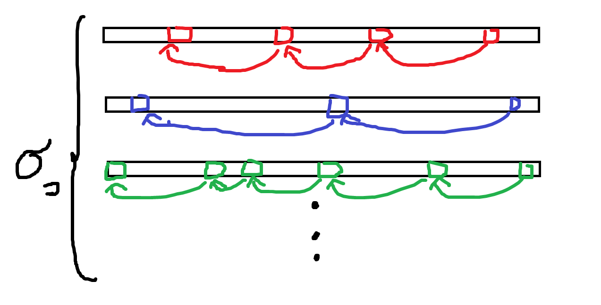

　下の問題の解説にあるやつ。

https://atcoder.jp/contests/abc214/tasks/abc214_f

---

## 自分の実装

```cpp
#include <bits/stdc++.h>
#include <atcoder/modint>
using namespace std;
using namespace atcoder;

using mint = modint1000000007;

int main(){
	string s;
	cin >> s;
	int n = s.size();

	vector<vector<int>> nxt(26, vector<int>(n+1, n));
	for(int i = n; i > 0; --i){
		for(int j = 0; j < 26; ++j){
			nxt[j][i-1] = nxt[j][i];
		}
		nxt[s[i-1]-'a'][i-1] = i-1;
	}

	vector<mint> dp(n);
	for(int i = 0; i < 26; ++i){
		if(nxt[i][0] != n){
			dp[nxt[i][0]] += 1;
		}
	}
	for(int i = 0; i < n; ++i){
		for(int j = 0; j < 26; ++j){
			if(nxt[j][i+1] != n){
				if(nxt[j][i+1] != i+1){
					dp[nxt[j][i+1]] += dp[i];
				}else if(nxt[j][i+2] != n){
					dp[nxt[j][i+2]] += dp[i];
				}
			}
		}
	}

	mint ans = 0;
	for(int i = 0; i < n; ++i) ans += dp[i];
	cout << ans.val() << endl;

	return 0;
}
```

部分列DPは[けんちょんさんの記事](https://qiita.com/drken/items/a207e5ae3ea2cf17f4bd)で勉強したので、その方針で実装することが多かった。

---

## 解説の実装

```cpp
#include <bits/stdc++.h>
#include <atcoder/modint>
using namespace std;
using namespace atcoder;

using mint = modint1000000007;

int main(){
	string s;
	cin >> s;
	int n = s.size();

	vector<mint> dp(n+2);
	dp[0] = 1;
	for(int i = 0; i < n; ++i){
		for(int j = i-1; ; --j){
			dp[i+2] += dp[j+1];
			if(j == -1 || s[j] == s[i]) break;
		}
	}

	mint ans = 0;
	for(int i = 2; i < n+2; ++i) ans += dp[i];
	cout << ans.val() << endl;
	return 0;
}
```

`nxt` を前計算しなくても良いという話。同じ文字が出てくるところまで遡る。

　文脈がないと一目 $O(N^2)$ にも見えるが、文字の種類ごとにわけて考えるとわかりやすい。



　**同じ文字の中では遡る区間は交差せず、高々 $n$ 回しか遡ることがない**ので、文字の種類数を $\sigma$ とすると時間計算量は $O(\sigma N)$ である。遡る区間が交差しないことが重要なので、「計算量を変えずに前計算部分をDPの本計算に組み込める」は一般的に成り立つ話ではない。遷移次第。

　この問題の場合は、最後に現れた位置と累積和を持つと $O(N)$ に改善できる。

