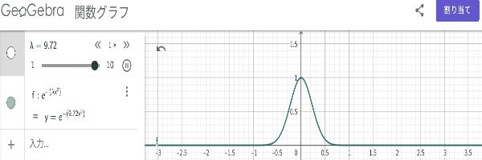
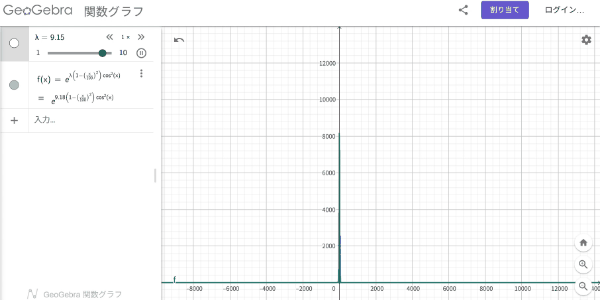

# 概要

　閉区間 $[a, b]$ 上の連続関数 $f, g$ に対して次の条件を仮定する。

1. $f$ は $x_0 \in (a, b)$ で最大値を取り、 $$ f(x_0) > f(x) \quad (x \in [a, b],\  x \ne x_0) $$  を満たす。
2. $f$ は $x_0$ において2階微分可能であり、 $$ f''(x_0) < 0 $$ を満たす。

このとき

$$
\begin{align}
\lim_{\lambda \to \infty} e^{-\lambda f(x_0)} \sqrt{\frac{\lambda}{2\pi}} \int_a^b e^{\lambda f(x)} g(x) \dd{x} = g(x_0) \sqrt{\frac{1}{-f''(x_0)}}.
\end{align}
$$

言い換えると、 $\lambda$ が十分に大きいとき、

$$
\begin{align}
\int_a^b e^{\lambda f(x)} g(x) \dd{x} \sim e^{\lambda f(x_0)} g(x_0) \sqrt{\frac{2\pi}{-\lambda f''(x_0)}}.
\end{align}
$$

　このような近似方法を**ラプラスの方法**という。

　$n$ 次元に拡張できるらしいが、本記事では1次元の場合のみを考える。[^1]

## 具体例

　「ラプラスの方法」が主張することは、 $\lambda$ が大きいとき、(1)式の左辺の積分値において $e^{\lambda f(x_0)}$ の値が支配的になるということである。直感的には確かにそうなりそうな気もするが、わかりやすさのためにいくつか具体例を見てみる。なお、以下の例では $g(x) = 1$ とした。

### 例1

$$
f(x) = - x^2
$$

### 例2

$$
f(x) = \qty{1-\pqty{\frac{x}{100}}^2} \cos^2 x
$$

 

---

 

　確かに、$\lambda$ が大きくなるにつれて、 $e^{\lambda f(x_0)}$ の値が支配的になっていることがわかる。 

# 計算

　 単に、「$e^{\lambda f(x_0)}$ の値が支配的になる」ということだけ言うのであれば、Wikipediaの「ラプラスの方法のアイディア」の記述で十分そう。

> 関数 $f(x)$ が点 $x_0$ においてのみ最大値をとると仮定する。数 $n$ に対して、次の関数を考える。
> $$
> \begin{aligned}
> g(x) &= n f(x) \\
> h(x) &= e^{n f(x)}
> \end{aligned}
> $$
> 点 $x_0$ において関数 $g$ と $h$ も最大値をとることに注意する。また、このとき
> $$
> \begin{aligned}
> \frac{g(x_0)}{g(x)} &= \frac{n f(x_0)}{n f(x)} = \frac{f(x_0)}{f(x)} \\
> \frac{h(x_0)}{h(x)} &= \frac{e^{n f(x_0)}}{e^{n f(x)}} = e^{n \pqty{f(x_0) - f(x)}}
> \end{aligned}
> $$
> である。
> 
> 数 $n$ が大きくなるにつれて $h$ の比は指数的に大きくなる一方で $g$ の比は変化しない。したがって、関数の積分における支配的な寄与は点 $x_0$ の近傍における点 $x$ のみから来るため近似ができる。
>
> <cite>Wikipedia, ラプラスの方法（参考文献[3]）より引用</cite>

横軸を $x$ でなく $f(x)$ にして考えるとより分かりやすそうで、グラフの横のスケールが変わっていないのに縦のスケールだけが大きくなっているようなイメージができる。

　以下に、(1)式の導出を示す。

## 導出

　関数 $f \in C^2([a, b])$ と $g \in C([a, b])$ があり、 $f$ は

$$
\begin{aligned}
f(x_0) &> f(x) \quad (x \in [a, b],\  x \ne x_0) , \\
f''(x_0) &< 0
\end{aligned}
$$

を満たすとする。このとき、(1)式が成り立つことを示す。

　$x_0$ の近傍で $f(x), \ g(x)$ をテイラー展開すると、 

$$
\begin{aligned}
f(x) &= f(x_0) + \frac{1}{2} f''(x_0) (x-x_0)^2 + o((x-x_0)^2) \quad (x \to x_0), \\
g(x) &= g(x_0) + o(1) \quad (x \to x_0).
\end{aligned}
$$

すなわち、任意の正数 $\epsilon$ に対して、 ある $\delta_1 > 0, \delta_2 > 0$ が存在して、 

$$
\begin{aligned}
\abs{f(x) - f(x_0) - \frac{1}{2} f''(x_0) (x-x_0)^2} < \epsilon (x-x_0)^2 \quad (\abs{x-x_0} \le \delta_1), \\
\abs{g(x) - g(x_0)} < \epsilon \quad (\abs{x-x_0} \le \delta_2).
\end{aligned}
$$

$\delta = \min(\delta_1, \delta_2)$ とすると、 

$$
\int_a^b e^{\lambda f(x)} g(x) \dd{x} = \int_{x_0 - \delta}^{x_0 + \delta} e^{\lambda f(x)} g(x) \dd{x} + \int_{\abs{x-x_0} \ge \delta} e^{\lambda f(x)} g(x) \dd{x} \equiv I_{in} + I_{out}.
$$

　$I_{in}$ は $x = x_0 + t / \sqrt{\lambda}$ と置換すると、

$$
\begin{aligned}
I_{in} &= \int_{x_0 - \delta}^{x_0 + \delta} \exp \qty{\lambda \pqty{f(x_0) + \frac{1}{2} (f''(x_0) \pm \epsilon) (x-x_0)^2}} \pqty{g(x_0) \pm \epsilon} \dd{x} \\
&= \exp \qty{\lambda f(x_0)} \pqty{g(x_0) \pm \epsilon} \int_{x_0 - \delta}^{x_0 + \delta} \exp \qty{\lambda \pqty{\frac{1}{2} (f''(x_0) \pm \epsilon) (x-x_0)^2}} \dd{x} \\
&= \frac{\exp \qty{\lambda f(x_0)}}{\sqrt{\lambda}} \pqty{g(x_0) \pm \epsilon} \int_{-\delta \sqrt{\lambda}}^{\delta \sqrt{\lambda}} \exp \qty{\frac{1}{2} (f''(x_0) \pm \epsilon) t^2} \dd{t}.
\end{aligned}
$$

$\epsilon$ を $0 < \epsilon < -f''(x_0)$ の範囲で取ることにすると、

$$
\begin{align}
e^{-\lambda f(x_0)} \sqrt{\lambda} I_{in} &= \pqty{g(x_0) \pm \epsilon} \int_{-\delta \sqrt{\lambda}}^{\delta \sqrt{\lambda}} \exp \qty{\frac{1}{2} (f''(x_0) \pm \epsilon) t^2} \dd{t} \notag \\
&\to \pqty{g(x_0) \pm \epsilon} \sqrt{\frac{2\pi}{-f''(x_0) \pm \epsilon}} \quad (\lambda \to \infty).
\end{align}
$$

　$I_{out}$ は、 $x_0$ が唯一の最大値を取る点であることから、 ある $c > 0$ が存在して、任意の $x : \abs{x-x_0} \ge \delta$ に対して、

$$
f(x) < f(x_0) - c.
$$

$A \equiv \abs{\sup_{\abs{x-x_0} \ge \delta} g(x)}$ とすると、 

$$
\begin{aligned}
\abs{I_{out}} \le A (b-a) e^{\lambda (f(x_0) - c)}
\end{aligned}
$$

と評価できて、

$$
\begin{align}
A (b-a) e^{\lambda (f(x_0) - c)} \to 0 \quad (\lambda \to \infty)
\end{align}
$$

より、

$$
\begin{aligned}
e^{-\lambda f(x_0)} \sqrt{\lambda} I_{out} \to 0 \quad (\lambda \to \infty).
\end{aligned}
$$

　$\epsilon$ は $0 < \epsilon < -f''(x_0)$ の範囲で任意に取れるので、 式(3),(4)より、

$$
\begin{aligned}
\lim_{\lambda \to \infty} e^{-\lambda f(x_0)} \sqrt{\lambda} \int_a^b e^{\lambda f(x)} g(x) \dd{x} &= g(x_0) \sqrt{\frac{2\pi}{-f''(x_0)}} \quad (\lambda \to \infty), \\
\lim_{\lambda \to \infty} e^{-\lambda f(x_0)} \sqrt{\frac{\lambda}{2\pi}} \int_a^b e^{\lambda f(x)} g(x) \dd{x} &= g(x_0) \sqrt{\frac{1}{-f''(x_0)}} \quad (\lambda \to \infty).
\end{aligned}
$$

　よって、(1)式が成り立つことが示された。

# Stirlingの公式

$$
n! \sim \sqrt{2\pi n} \pqty{\frac{n}{e}}^n
$$

をラプラスの方法を使って示すことができる。具体的には、

$$
\begin{aligned}
n! &= \Gamma(n+1) \\
&= \int_0^\infty e^{-t} t^n \dd{t}
\end{aligned}
$$

と表し、$x = ny$ と置換すると、

$$
\begin{aligned}
\int_0^\infty e^{-t} t^n \dd{t} &= n^{n+1} \int_0^\infty e^{-ny} y^n \dd{y} \\
&= n^{n+1} \int_0^\infty e^{-n \pqty{\log y - y}} \dd{y}.
\end{aligned}
$$

　ここで、 $f(y) = \log y - y, \ g(y) = 1$ とすると、 $f$ は $y = 1$ で最大値を取り、 $f''(1) = -1$ である。したがって、ラプラスの方法が適用できて、

$$
\begin{aligned}
n! &\sim n^{n+1} e^{nf(1)} \sqrt{\frac{2\pi}{-nf''(1)}} \\
&= \sqrt{2\pi n} \pqty{\frac{n}{e}}^n.
\end{aligned}
$$

# おわり

　議論の飛躍が無いように注意したつもりだけど、普段の生活の中で数学の話をすることがあまり無いので、穴がありそうで怖い。

　本当は誤差評価（収束スピード）についても議論したかったのだけど、よくわかんなくなってやめちゃった。外側は指数関数的に収束するけど、内側はどうなるのかな。いつかの授業でこういう近似の評価の仕方を聞いた気もするんだけど...。

 

 

## 参考文献
- [1] 高橋陽一郎, 実関数とFourier解析2, 岩波書店, 1998.
- [2]「海洋波論」　講義ノート, https://med.ynu.ac.jp/Ocean%20wave.pdf, 2025年5月12日閲覧.
- [3] Wikipedia, ラプラスの方法, https://ja.wikipedia.org/wiki/%E3%83%A9%E3%83%97%E3%83%A9%E3%82%B9%E3%81%AE%E6%96%B9%E6%B3%95, 2025年5月12日閲覧.

[^1]: 参考文献[1] では $B \subset \mathbb{R}^n$ の有界閉領域に拡張したものをLaplaceの方法として扱っている。
