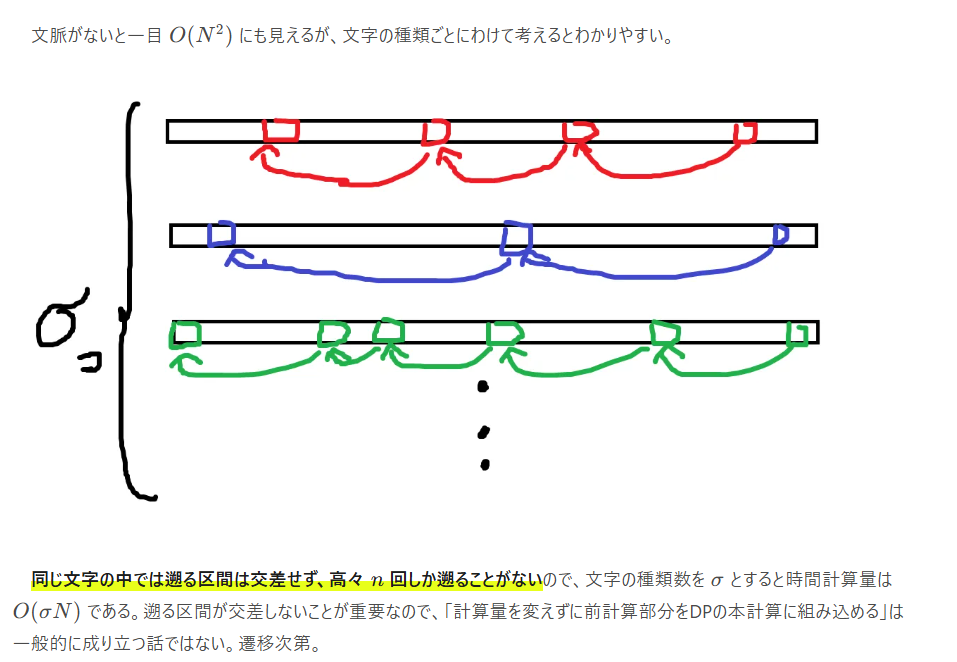
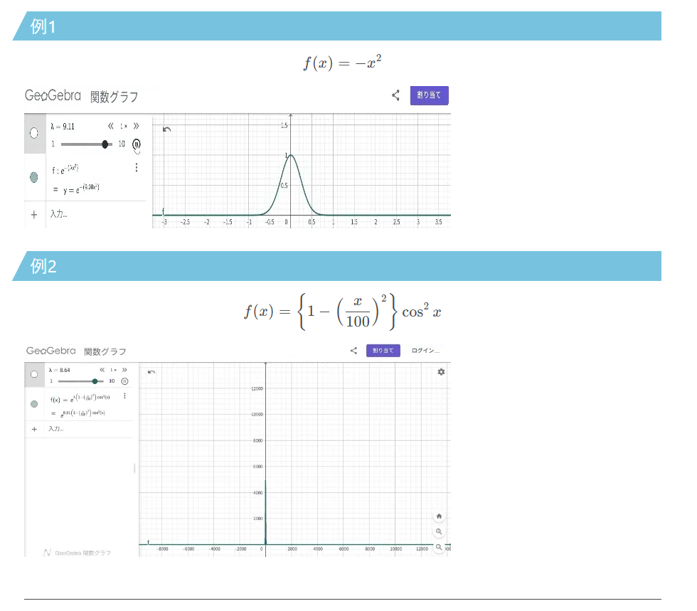

import { YouTube } from "@astro-community/astro-embed-youtube";

# やりたいこと

画像、gif、動画の表示を改善したい。画像は今こんな感じ。



gifはなぜか左に寄っている。



動画に至っては現状埋め込むことができない。

# どうするか
　自分がパッと思いつく方法は二つ。
- Remarkのプラグインで対応
- MDXを使う+適当なUIコンポーネントを作る

　前者であれば、astroに限らずいろんなところで使えそう。ただ、自分はRemarkのプラグインを作ったことがない。

　後者の場合はMDXを利用できることが前提になるので、使える環境は限られそう。ただ、自分にとってはこっちの方が馴染みがあるし、拡張性も高そう。

　当分このサイトを捨てるつもりはないし、新しくブログサイトを作る予定もないので、後者の方法でやっていこうと思う。

# 要件

- 画像・gif・動画を表示できる
- 画像・gifはクリックで拡大表示できる
- 動画はクリックで再生できる
- 画像・gif・動画はレスポンシブ対応
- キャプションをつけられる
- 記事に埋め込むときにサイズを指定できる
- 枠線や角丸をつけられる
- YouTubeを埋め込むことができる

大体こんな感じ。YouTubeに関しては最初の要望にはなかったんだけど、結構簡単に出来そうなのでついでにやってみる。

# 実装

まずは、公式インテグレーションをインストールして、MDXを使えるようにしよう。

https://docs.astro.build/ja/guides/integrations-guide/mdx/


## YouTubeの埋め込み

　`astro-embed-youtube`というコンポーネントを利用する。

https://astro-embed.netlify.app/components/youtube/

公式ドキュメントに則って作業を進める。
```bash
$ npm install @astro-community/astro-embed-youtube
```

```md
---
title: "YouTubeの埋め込み"
---
import { YouTube } from "@astro-community/astro-embed-youtube";
<YouTube id="Jak2qiq_jJo" posterQuality="max" title="【初音ミク】 メリュー 【オリジナル】 HatsuneMiku - Meru" class="mx-auto"/>
```

<YouTube id="Jak2qiq_jJo" posterQuality="max" title="【初音ミク】 メリュー 【オリジナル】 HatsuneMiku - Meru" class="mx-auto"/>

